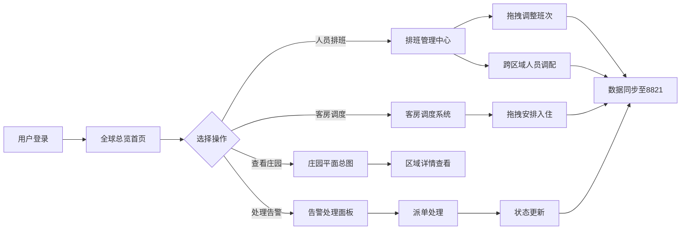

## 1. 产品概述

全球庄园管理可视化系统是一套面向高端私人庄园集团的综合管理平台，集中管控分布于全球各地的庄园值守、客房、安保等核心业务。通过直观的可视化操作界面，实现庄园资源实时监控、人员智能调度、服务动态调配。

- 目标用户：庄园集团管理层、区域运营总监、庄园首席管家
- 核心价值：全球资源一屏掌控，运营效率提升60%，应急响应时间缩短80%

---

## 2. 核心功能

### 2.1 用户角色

| 角色 | 登录方式 | 核心权限 |
|------|---------|---------|
| 集团管理员 | 账号密码登录 | 全庄园数据查看、跨区域人员调配、系统配置 |
| 区域总监 | 账号密码登录 | 所属区域庄园管理、客房调度、区域内人员调配 |
| 庄园管家 | 账号密码登录 | 单庄园日常运营、客房入住调整、本地排班管理 |

### 2.2 功能模块

1. **全球总览首页**：世界地图庄园分布、当日开销汇总、接待安排总览、告警提示面板
2. **庄园平面总图**：交互式庄园平面图、功能区域色块标注、设施状态实时显示
3. **排班管理中心**：管家/安保/后勤人员排班表、拖拽式班次调整、跨区域人员调配
4. **客房调度系统**：客房入住日历、拖拽式入住安排、房态实时更新
5. **物资告警面板**：设施损坏高亮、物资短缺提醒、告警处理流程
6. **人员调配看板**：在岗人员实时状态、临时任务派发、跨区域支援调度

### 2.3 页面详情

| 页面名称 | 模块名称 | 功能描述 |
|---------|---------|----------|
| 全球总览首页 | 世界地图分布 | 标注全球各庄园地理位置，点击进入详情 |
| 全球总览首页 | 运营数据概览 | 当日总开销、接待人次、入住率、在岗人数统计卡片 |
| 全球总览首页 | 告警消息中心 | 设施损坏、物资短缺、人员异常等告警列表，高亮显示 |
| 全球总览首页 | 今日接待安排 | 所有庄园当日宾客抵达、活动安排时间线 |
| 庄园详情页 | 平面总图 | SVG交互式平面图，主楼/客房/展厅/马场/码头色块区分 |
| 庄园详情页 | 区域状态面板 | 各功能区实时状态、人员在岗情况、设施健康度 |
| 排班管理页 | 周排班日历 | 管家/安保/后勤三类人员周视图排班表 |
| 排班管理页 | 拖拽排班调整 | 拖拽班次卡片到不同日期/人员，实时更新 |
| 排班管理页 | 跨区域调配 | 人员列表拖拽至目标庄园，生成本调配单 |
| 客房调度页 | 房态总图 | 所有客房状态色块展示（空置/入住/清洁/维修） |
| 客房调度页 | 入住安排日历 | 拖拽宾客订单到客房，调整入住日期 |
| 物资告警页 | 告警列表 | 设施损坏、物资短缺分级告警，高亮显示 |
| 物资告警页 | 告警处理 | 一键派单、状态跟踪、处理记录 |

---

## 3. 核心流程

### 3.1 主要操作流程

用户登录系统后进入全球总览首页，查看各庄园运营状态与告警信息。点击特定庄园进入详情页面，查看平面总图与各区域状态。在排班管理中心通过拖拽方式调整人员班次，如需跨区域支援则从人员池拖拽至目标庄园。客房调度页面中，将宾客预订拖拽至对应客房完成入住安排。系统自动监控设施与物资状态，异常情况在告警面板高亮提醒，用户点击告警项进入处理流程。

### 3.2 核心业务流程图

---

## 4. 用户界面设计

### 4.1 设计风格

- **主色调**：深邃帝王蓝 `#1a2744`，营造高端奢华氛围
- **辅助色**：
  - 主楼：鎏金色 `#c9a962`
  - 客房：暖玉色 `#e8d5b7`
  - 藏品展厅：勃艮第红 `#722f37`
  - 私人马场：森林绿 `#3d5a45`
  - 游艇码头：海洋蓝 `#2e5e8b`
  - 告警红色：`#dc3545`，物资短缺橙色：`#fd7e14`
- **按钮风格**：微立体圆角按钮，悬浮上浮发光效果
- **字体**：标题使用「思源宋体」展示高端质感，正文使用「思源黑体」保证可读性
- **布局风格**：深色玻璃拟态卡片布局，多层叠加营造纵深感
- **图标风格**：线性金色描边图标，配合状态色块填充

### 4.2 页面设计概览

| 页面名称 | 模块名称 | UI元素设计 |
|---------|---------|-----------|
| 全球总览首页 | 世界地图分布 | 深色底图 + 金色庄园标记点 + 脉冲动画 + 悬浮信息卡 |
| 全球总览首页 | 运营数据概览 | 玻璃拟态卡片 + 大号金色数字 + 趋势小图表 + 渐变边框 |
| 全球总览首页 | 告警消息中心 | 红色/橙色高亮行 + 闪烁图标 + 优先级标签 + 悬浮展开 |
| 全球总览首页 | 今日接待安排 | 垂直时间线 + 庄园色标 + 宾客信息卡 + 状态进度条 |
| 庄园详情页 | 平面总图 | SVG分层地图 + 区域悬浮高亮 + 点击进入详情 + 状态色块覆盖 |
| 庄园详情页 | 区域状态面板 | 右侧滑出面板 + 人员头像组 + 设施进度环 + 物资条形图 |
| 排班管理页 | 周排班日历 | 时间轴网格 + 拖拽班次卡片 + 人员纵向列表 + 颜色分类 |
| 客房调度页 | 房态总图 | 楼层平面图 + 客房色块 + 入住宾客头像 + 悬浮详情 |
| 物资告警页 | 告警列表 | 分级颜色条 + 告警类型图标 + 倒计时处理 + 一键派单按钮 |

### 4.3 响应式设计

- **设计优先级**：桌面端优先（1920×1080为基准）
- **交互方式**：全程鼠标点击 + 拖拽操作，支持触屏设备手势
- **适配范围**：
  - 大屏显示器（>1920px）：等比缩放，保持布局比例
  - 标准桌面（1366-1920px）：完整显示所有模块
  - 平板横屏（1024-1366px）：侧边栏收起为图标模式
  - 不支持小屏手机竖屏模式

### 4.4 交互动效设计

- **页面加载**：模块从下往上渐入，错位100ms形成波浪感
- **拖拽操作**：被拖拽元素半透明放大，目标区域金色边框闪烁
- **告警提示**：新告警从右侧滑入，红色脉冲光晕循环
- **悬浮效果**：卡片上浮3px + 金色外发光 + 阴影加深
- **数据更新**：数字变化时滚动动画，进度条平滑过渡
