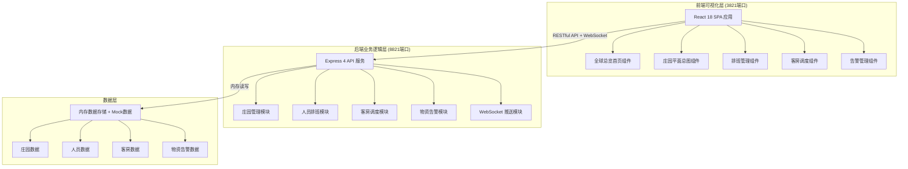
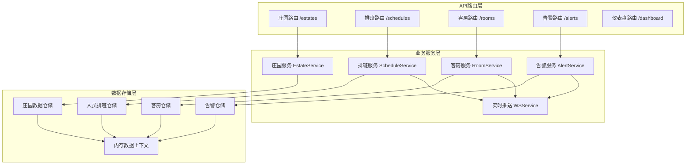
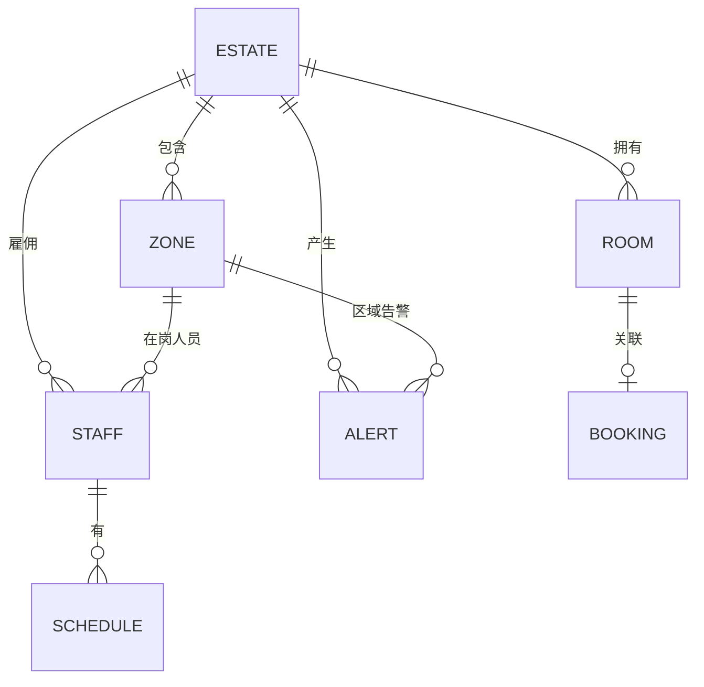

## 1. 架构设计



---

## 2. 技术说明

- **前端**：React@18 + TypeScript + TailwindCSS@3 + Vite + React Router v6
- **拖拽库**：@dnd-kit/core + @dnd-kit/sortable（高性能拖拽交互）
- **图表库**：recharts（数据可视化图表）
- **地图**：自定义SVG组件（庄园平面图 + 世界分布示意）
- **图标**：lucide-react（线性图标库）
- **初始化工具**：Vite 5.x
- **后端**：Express@4 + TypeScript + cors + ws（WebSocket）
- **数据**：内存数据结构 + 丰富Mock数据，启动时自动初始化
- **实时通信**：WebSocket实现告警实时推送与数据同步

---

## 3. 路由定义

| 前端路由 | 页面用途 |
|---------|---------|
| `/` | 全球总览首页（默认首页） |
| `/estate/:id` | 庄园详情页（含平面总图） |
| `/scheduling` | 排班管理中心 |
| `/rooms` | 客房调度系统 |
| `/alerts` | 物资告警面板 |

| 后端API路由 | 方法 | 用途 |
|------------|------|------|
| `/api/estates` | GET | 获取所有庄园列表 |
| `/api/estates/:id` | GET | 获取单个庄园详情（含平面图数据） |
| `/api/estates/:id/staff` | GET | 获取庄园人员列表 |
| `/api/schedules` | GET | 获取排班数据 |
| `/api/schedules` | PUT | 更新排班（含跨区域调配） |
| `/api/rooms` | GET | 获取所有客房状态 |
| `/api/rooms/bookings` | GET | 获取客房预订列表 |
| `/api/rooms/assign` | POST | 安排/调整客房入住 |
| `/api/alerts` | GET | 获取告警列表 |
| `/api/alerts/:id/handle` | POST | 处理告警 |
| `/api/dashboard/summary` | GET | 获取首页汇总数据 |

---

## 4. API 数据类型定义

```typescript
// 庄园信息
interface Estate {
  id: string;
  name: string;
  location: { country: string; city: string; lat: number; lng: number };
  zones: EstateZone[];
  dailyExpense: number;
  todayReceptions: Reception[];
}

// 庄园功能区
interface EstateZone {
  id: string;
  type: 'main_building' | 'guest_room' | 'exhibition' | 'horse_farm' | 'marina';
  name: string;
  bounds: { x: number; y: number; width: number; height: number };
  color: string;
  status: { healthScore: number; alertCount: number };
  onDutyStaff: string[];
}

// 人员信息
interface Staff {
  id: string;
  name: string;
  role: 'butler' | 'security' | 'logistics';
  estateId: string;
  avatar: string;
  status: 'on_duty' | 'off_duty' | 'leave' | 'transferred';
  currentZoneId?: string;
}

// 排班记录
interface Schedule {
  id: string;
  staffId: string;
  estateId: string;
  date: string;
  shift: 'morning' | 'afternoon' | 'night';
  zoneId?: string;
}

// 客房信息
interface Room {
  id: string;
  estateId: string;
  floor: number;
  roomNo: string;
  type: string;
  status: 'vacant' | 'occupied' | 'cleaning' | 'maintenance';
  currentGuest?: Guest;
}

// 预订/入住记录
interface Booking {
  id: string;
  guestName: string;
  guestAvatar?: string;
  roomId?: string;
  checkIn: string;
  checkOut: string;
  status: 'pending' | 'checked_in' | 'checked_out';
}

// 告警信息
interface Alert {
  id: string;
  estateId: string;
  zoneId?: string;
  type: 'facility_damage' | 'supply_shortage' | 'staff_abnormal';
  priority: 'high' | 'medium' | 'low';
  title: string;
  description: string;
  createdAt: string;
  status: 'pending' | 'handling' | 'resolved';
  handlerId?: string;
}

// 首页汇总数据
interface DashboardSummary {
  totalEstates: number;
  totalOnDuty: number;
  todayRevenue: number;
  todayExpense: number;
  occupancyRate: number;
  todayGuests: number;
  activeAlerts: { high: number; medium: number; low: number };
  todayReceptions: Reception[];
}
```

---

## 5. 后端服务架构图



---

## 6. 数据模型

### 6.1 实体关系图



### 6.2 项目目录结构

```
lj0061/
├── server/                     # 后端服务(8821端口)
│   ├── src/
│   │   ├── index.ts           # 服务入口
│   │   ├── data/              # Mock数据
│   │   │   └── mockData.ts
│   │   ├── routes/            # API路由
│   │   │   ├── estates.ts
│   │   │   ├── schedules.ts
│   │   │   ├── rooms.ts
│   │   │   ├── alerts.ts
│   │   │   └── dashboard.ts
│   │   ├── services/          # 业务逻辑
│   │   │   ├── EstateService.ts
│   │   │   ├── ScheduleService.ts
│   │   │   ├── RoomService.ts
│   │   │   ├── AlertService.ts
│   │   │   └── WSService.ts
│   │   └── types/             # 类型定义
│   │       └── index.ts
│   └── package.json
│
├── client/                     # 前端应用(3821端口)
│   ├── src/
│   │   ├── main.tsx
│   │   ├── App.tsx
│   │   ├── api/                # API封装
│   │   │   └── index.ts
│   │   ├── types/              # 类型定义
│   │   │   └── index.ts
│   │   ├── components/         # 通用组件
│   │   │   ├── Layout.tsx
│   │   │   ├── Sidebar.tsx
│   │   │   ├── AlertBadge.tsx
│   │   │   ├── StatCard.tsx
│   │   │   └── DraggableCard.tsx
│   │   ├── pages/              # 页面组件
│   │   │   ├── Dashboard.tsx
│   │   │   ├── EstateDetail.tsx
│   │   │   ├── Scheduling.tsx
│   │   │   ├── RoomDispatch.tsx
│   │   │   └── AlertPanel.tsx
│   │   ├── features/           # 业务模块
│   │   │   ├── world-map/
│   │   │   ├── floor-plan/
│   │   │   ├── schedule-grid/
│   │   │   └── room-calendar/
│   │   └── styles/
│   │       └── globals.css
│   ├── index.html
│   ├── tailwind.config.js
│   ├── vite.config.ts
│   └── package.json
│
└── start-all.bat               # 一键启动脚本
```
